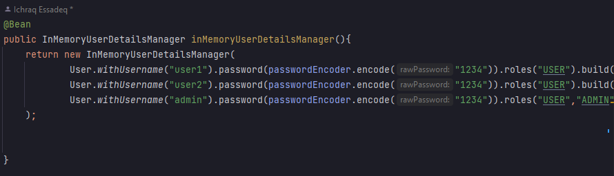
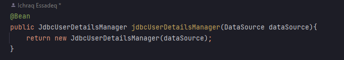
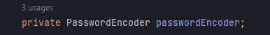
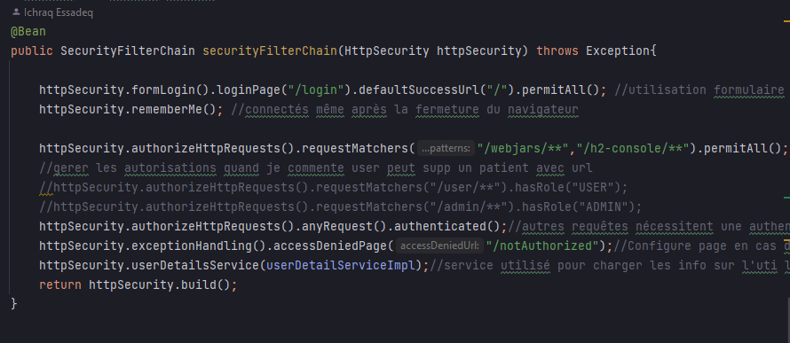
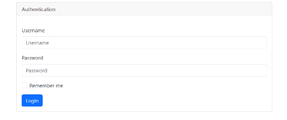
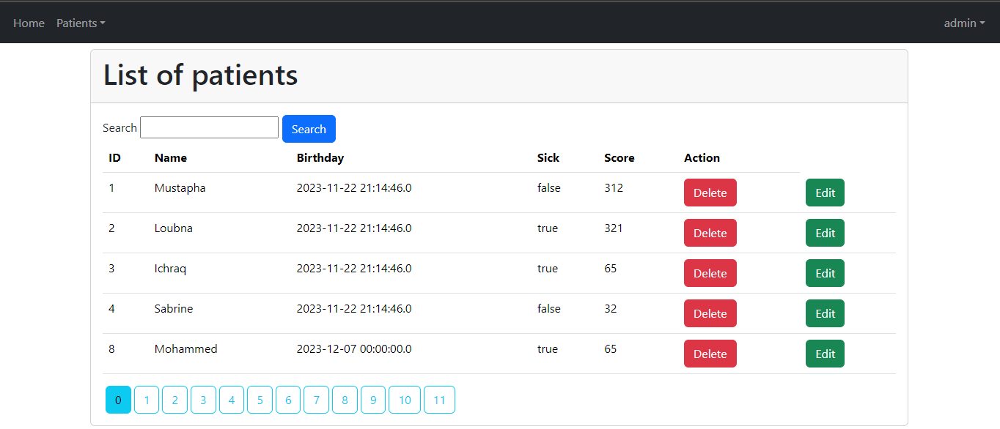
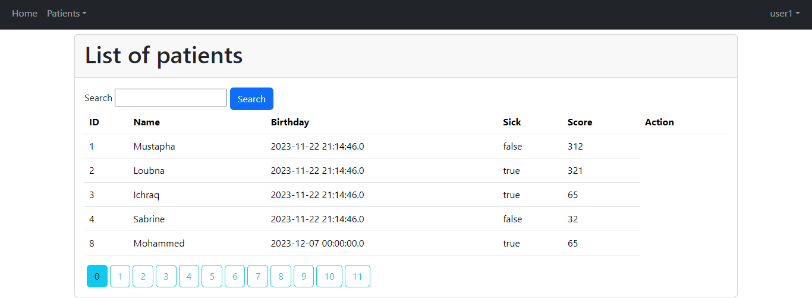
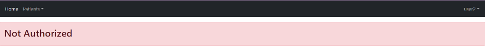

<h1>Controle</h1>

<h2>Development Web JEE Spring MVC</h2>
<h3>Introduction</h3>

Dans l'écosystème en constante évolution des applications informatiques, la sécurité occupe une place centrale, et les applications basées sur Spring Boot ne font pas exception. La protection des données sensibles, la prévention des cyberattaques et la conformité aux normes de sécurité sont devenues des impératifs incontournables. Dans cette optique, sécuriser une application Spring Boot revêt une importance cruciale, allant au-delà de la simple protection des informations confidentielles. C'est un gage de confiance pour les utilisateurs, un rempart contre les menaces émergentes et une obligation incontournable pour répondre aux exigences réglementaires en perpétuelle évolution. Cette introduction explore les raisons pour lesquelles la sécurisation des applications Spring Boot est devenue une priorité incontournable dans le paysage technologique d'aujourd'hui.

<h3>Concept de base</h3>

<h4>InMemory Authentication</h4>

L'authentification InMemory dans Spring Boot offre une solution rapide et simple pour sécuriser une application. Les informations d'identification des utilisateurs sont stockées en mémoire, ce qui convient particulièrement aux petites applications ou aux phases de développement. Cependant, elle présente des limitations en termes de gestion des utilisateurs et de scalabilité, car les données d'authentification ne persistent pas entre les redémarrages de l'application. Malgré ses avantages pour les cas d'utilisation simples, elle peut ne pas être la solution optimale pour des applications plus complexes nécessitant une gestion avancée des utilisateurs.

<h4>JDBC Authentication</h4>

L'authentification JDBC de Spring Boot permet de stocker les informations d'identification des utilisateurs dans une base de données relationnelle. Cela offre une meilleure gestion des utilisateurs et la possibilité de mettre en œuvre des fonctionnalités avancées telles que la récupération de mot de passe. En utilisant JDBC, les informations d'authentification persistent entre les redémarrages de l'application, améliorant ainsi la robustesse et la pérennité du système. Cependant, il est important de noter que cette approche implique une interaction avec une base de données, ce qui peut introduire un léger surcoût en termes de performances.

<h4>UserDetails Authentication</h4>

L'authentification UserDetails de Spring Boot repose sur une approche basée sur les objets UserDetails fournis par l'interface Spring Security. Cela permet une flexibilité accrue, car les détails de l'utilisateur peuvent être récupérés à partir de différentes sources, telles que des bases de données, des services distants, ou même des services web. Cette approche offre une gestion avancée des utilisateurs avec la possibilité de personnaliser les informations d'identification, les rôles et d'autres attributs. L'utilisation d'UserDetails facilite également l'intégration avec d'autres fonctionnalités de sécurité offertes par Spring Security. Bien que cela puisse demander une configuration plus détaillée, cela offre une solution puissante et adaptable pour répondre aux besoins spécifiques des applications complexes.

<h3>Realisation</h3>

<h4>La classe SecurityConfig</h4>

La classe SecurityConfig joue un rôle central en tant que configuration principale pour la sécurité de l'application Spring. Annotée avec @Configuration, elle permet la définition de beans et de configurations. En activant la sécurité web de Spring Security avec @EnableWebSecurity et la sécurité basée sur les annotations pour les méthodes avec @EnableMethodSecurity(prePostEnabled = true), elle établit des stratégies d'authentification et définit des règles de sécurité au niveau des méthodes.
Cette classe tire parti de Lombok avec l'annotation @AllArgsConstructor, générant automatiquement un constructeur prenant tous les champs comme paramètres, facilitant ainsi l'injection de dépendances. Parmi les attributs, on retrouve un bean de PasswordEncoder pour sécuriser les mots de passe stockés, ainsi qu'un UserDetailServiceImpl, un service personnalisé implémentant l'interface UserDetailsService, utilisé pour récupérer les détails de l'utilisateur pendant le processus d'authentification.
Dans son ensemble, SecurityConfig coordonne les mécanismes de sécurité en définissant des stratégies d'authentification, en configurant des gestionnaires de détails d'utilisateurs et en spécifiant des règles d'autorisation pour les URL. Cette classe offre une approche complète en combinant des configurations en mémoire et basées sur une base de données, tout en orchestrant l'ensemble des mécanismes de sécurité pour l'application web Spring.

<h3>InMemoryAuthentification dans SecurityConfig</h3>

<h3>JdbcAuthentication dans SecurityConfig</h3>

<h3>UserDetailsService dans SecurityConfig</h3>

<h4>Sécuriser les données des utilisateurs</h4>

La sécurité des données des utilisateurs est une priorité fondamentale de l'application. En utilisant passwordEncoder.encode(), les mots de passe des utilisateurs sont cryptés avant d'être stockés dans la base de données. Cette étape est cruciale pour assurer la confidentialité des informations sensibles et empêcher les accès non autorisés.

<h4>Gérer les droits d'accès</h4>

Cette section cruciale de notre application met l'accent sur une gestion minutieuse des droits d'accès, jouant un rôle central dans la sécurité globale. En exploitant judicieusement les fonctionnalités de Spring Security, notre configuration permet une maîtrise précise des autorisations, spécialement en définissant des règles spécifiques pour l'accès à des ressources telles que les Webjars et la console H2. La classe SecurityConfig offre une flexibilité notable en autorisant la création de règles basées sur les rôles des utilisateurs, simplifiée par l'utilisation des méthodes hasRole("USER") et hasRole("ADMIN").

<h5>Personnalisation du Processus de Connexion avec "httpSecurity.formLogin().loginPage("/login").defaultSuccessUrl("/").permitAll();"</h5>

httpSecurity.formLogin() : Active la gestion du processus de connexion fourni par Spring Security. .loginPage("/login") : Spécifie la page de connexion personnalisée. Plutôt que d'utiliser la page de connexion par défaut fournie par Spring Security, l'application redirigera les utilisateurs vers la page spécifiée ("/login") lorsqu'une authentification est requise. .defaultSuccessUrl("/") : Définit l'URL par défaut vers laquelle un utilisateur est redirigé après une connexion réussie. Dans ce cas, l'utilisateur est redirigé vers la page principale ("/"). .permitAll() : Autorise l'accès à la page de connexion spécifiée par n'importe quel utilisateur, même s'il n'est pas authentifié. Cela garantit que la page de connexion est accessible à tous, même à ceux qui ne sont pas encore connectés.

<h5>Gestion Conditionnelle de l'Affichage Selon le Rôle de l'Utilisateur :</h5>

Dans la classe PatientController, l'affichage des patients est géré de manière conditionnelle en fonction du rôle de l'utilisateur. Les méthodes telles que delete, editPatient, formPatient, et save sont annotées avec @PreAuthorize("hasRole('ROLE_ADMIN')"), ce qui signifie que seuls les utilisateurs ayant le rôle d'administrateur peuvent accéder à ces fonctionnalités. Par conséquent, l'affichage et l'accès à certaines fonctionnalités de gestion des patients sont restreints aux utilisateurs ayant le rôle spécifique d'administrateur. Cela garantit une expérience utilisateur sécurisée et adaptée en fonction du rôle attribué à chaque utilisateur dans le système.

<h6>Interface de l'admin:</h6>

<h6>Interface user:</h6>

<h5>Gestion des accés non autorisés :</h5>

Et si un utilisateur tente d'accéder à une ressource pour laquelle il n'a pas les autorisations nécessaires, il sera redirigé vers la page définie, ici /notAuthorized, comme dans ce cas là:

